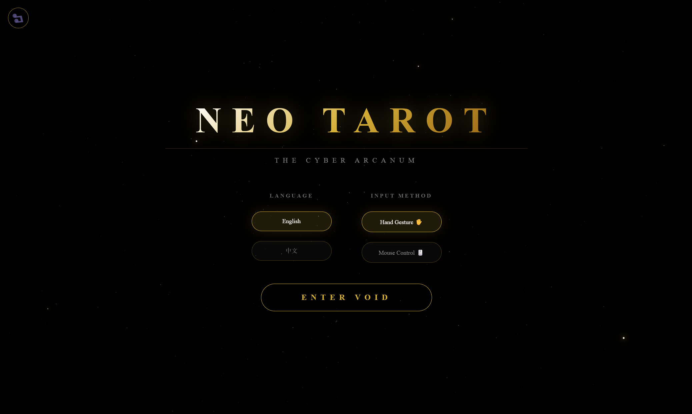

<div align="center">
  <h1>🕶️ Neo Tarot | neo塔罗</h1>
  <h3>The Cyber Arcanum / 赛博奥秘</h3>
  <p>
    <strong>Visual Gesture Control × DeepSeek Brain × Pure HTML</strong>
    <br>
    视觉手势识别 × DeepSeek 大脑 × 纯原生手搓
  </p>

<p>
  <a href="https://neotarot.vercel.app/">🔴 Live Demo / 在线体验</a> • 
  <a href="#-the-concept">🔮 Concept</a> • 
  <a href="#-the-ai-team">🤖 AI Team</a> • 
  <a href="#-features">✨ Features</a> • 
  <a href="#-how-to-run">🚀 Run</a> • 
  <a href="#-configuration">⚙️ Config</a> • 
  <a href="#-feedback">💬 Feedback</a>
</p>

  </div>

---
<div align="center">
  
</div>

## 🔮 The Concept / 核心理念

> "Wake up, Neo..."
> "醒醒，尼奥..."

**Neo Tarot** is a cyberpunk divination experiment built with code and AI.
**Neo Tarot** 是一个由代码和 AI 构建的赛博占卜实验。

Unlike "Life K-Line" which visualizes the **Macro Trend** of destiny, Neo Tarot is a **Micro Debugging Tool** for your present moment. It doesn't ask about the distant future; it helps you troubleshoot the runtime errors of your current life.

如果说“人生 K 线”描绘的是命运的 **宏观走势 (Macro Trend)**，那 **Neo Tarot** 就是为你当下的生活进行一次 **微观调试 (Micro Debug)**。它不问终点，只解决你此时此刻的 Runtime Error。

## 🤖 The AI Team / 赛博团队

This project is an "AI Chimera". I am just the prompt engineer.
这个项目是一个 AI 缝合怪。我只是一个只会喊 666 的提示词工程师。

| Role / 职责 | AI Model / 模型 | Description / 描述 |
| :--- | :--- | :--- |
| **The Architect** <br> 架构师 & 码农 | **Gemini** | Wrote 99% of the Vanilla JS code. <br> 写了 99% 的代码，虽然有时候它自己看了都摇头。 |
| **The Oracle** <br> 先知 | **DeepSeek V3** | Provides sharp, personalized readings. <br> 拒绝废话，提供直击灵魂的个性化解牌。 |
| **The Artist** <br> 宫廷画师 | **ChatGPT (DALL-E 3)** | Generated all the tarot card assets. <br> 生成了所有的塔罗牌面。 |
| **The Eyes** <br> 视觉中枢 | **MediaPipe** | Hand tracking & Gesture recognition. <br> 让你的摄像头看懂你的手势。 |
| **The Bard** <br> 吟游诗人 | **Suno** | Generated the immersive BGM. <br> 生成了赛博风背景音乐。 |

## ✨ Features / 功能亮点

### 1. ✋ Visual Gesture Control / 视觉手势控制
Forget the mouse. Use your hand to shuffle and draw cards in the air.
忘了鼠标吧。对着摄像头挥手，隔空洗牌、抽牌。
*(Powered by MediaPipe Computer Vision)*

<div align="center">
  
</div>


### 2. 🧠 DeepSeek Integration / 接入 DeepSeek
We don't use hard-coded interpretations. Every reading is generated in real-time based on your specific question.
拒绝死板的固定话术。每一条解牌都是根据你的具体问题，由大模型实时生成的。

### 3. 📱 Cross-Platform / 双端适配
- **Desktop**: Air Gestures (immersive mode).
- **Mobile**: Touch controls (lazy mode).
- **电脑端**：沉浸式隔空手势。
- **手机端**：躺平式触屏操作。

### 4. ⚡ Pure Vanilla / 纯原生手搓
No React. No Vue. No Build Tools. Just pure HTML/CSS/JS.
没有框架，没有编译，只有纯粹的代码。

### 5. 🎨 AI Art / AI 艺术
The unique tarot deck was generated by **GPT (DALL-E 3)**, creating a consistent visual style.
独特的塔罗牌面由 **GPT** 生成，构建了统一的视觉风格。

## 🚀 Quick Start / 快速运行

### Option 1: Online Demo / 在线体验 (No Install)

* **Mirror 1 (Vercel)**: **[https://neotarot.vercel.app/](https://neotarot.vercel.app/)**
    * *Recommended for global users. Faster speed.*
    * *推荐全球用户使用，速度更快（需魔法）。*

* **Mirror 2 (GitHub Pages)**: **[https://hqzzdsda.github.io/neo.tarot/](https://hqzzdsda.github.io/neo.tarot/)**
    * *Alternative link. Try this if Vercel is blocked.*
    * *备用线路。如果 Vercel 打不开，请尝试这个（国内网络兼容性较好）。*
      
### Option 2: Localhost
Clone the repo and run it locally.
克隆仓库并在本地运行。

```bash
# 1. Clone
git clone [https://github.com/](https://github.com/)[hqzzdsda]/neo-tarot.git

# 2. Enter directory
cd neo-tarot

# 3. Start a local server (Important! Camera requires HTTPS or Localhost)
# ⚠️ 注意：由于浏览器安全限制，摄像头必须在本地服务器环境下才能调用，不能直接双击打开 html。

# If you have Python:
python -m http.server 8000

# Or use "Live Server" extension in VS Code.
```

## ⚙️ Configuration / 配置

To use your own API Key (DeepSeek/Gemini), open `script.js` and find the following line:
如果你想使用自己的 API Key（因为内置额度可能用完），请打开 `script.js` 并修改：

```javascript
// Replace with your own key if the free quota runs out
// 如果免费额度用完了，请替换为你自己的 Key
const API_KEY = "sk-xxxxxxxxxxxxxxxxxxxxxxxx";
```

Note: Since this is a client-side app, your key is visible in the source code. It is recommended to set usage limits on your API provider's dashboard. 注意：由于这是纯前端应用，Key 会暴露在源码中。建议在 API 提供商后台设置用量上限以防盗刷。

## 💬 Feedback / 反馈
I built this as a coding beginner with Gemini's magic. 作为一个代码小白，这是我在 Gemini 的魔法下完成的作品。

If you find any bugs (or if the Oracle predicts something weird), let me know via Issues! 如果发现 BUG（或者先知说了什么奇怪的话），欢迎提 Issue 反馈！

## 版权声明 | Copyright Notice

本项目代码仅供个人学习与展示使用。未经作者显式授权，严禁任何形式的转载、抓取、照抄或用于商业用途。

This project and its code are for personal demonstration and educational purposes only. Unauthorized reproduction, crawling, copying, or commercial use of any kind is strictly prohibited without explicit permission from the author.

Copyright (c) 2024 [HUQIUZHI/hqzzdsda]. All rights reserved.

